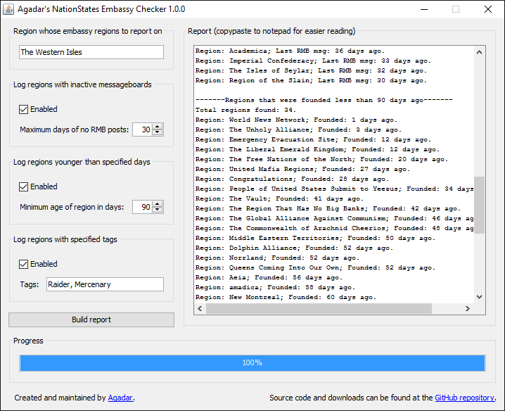

# Agadar's NationStates Embassy Checker

Originally created for [The Western Isles](http://www.nationstates.net/region=the_western_isles) region on [NationStates](http://www.nationstates.net/), this program reports on a specific region's embassy regions that do not meet specified criteria. The generated report is displayed in a text area, which users can easily copypaste to notepad or other text editors for saving. This program is especially useful for regions that have a large number of embassies and wish to start removing embassies with inactive 
or unwanted regions. 

Note that this program only **_reports_** on embassy regions; if you wish to remove the embassies of reported regions, then you will still have to manually remove them yourself.

This program uses my own [NationStates API Java Wrapper](https://github.com/Agadar/NationStates-api-java-wrapper) to communicate with the NationStates API.

Users can specify the following criteria:
* The maximum number of days between now and the last post on the region's message board;
* The minimum number of days between now and when the region was founded;
* One or more regional tags which the region shouldn't have.

## Screenshot

